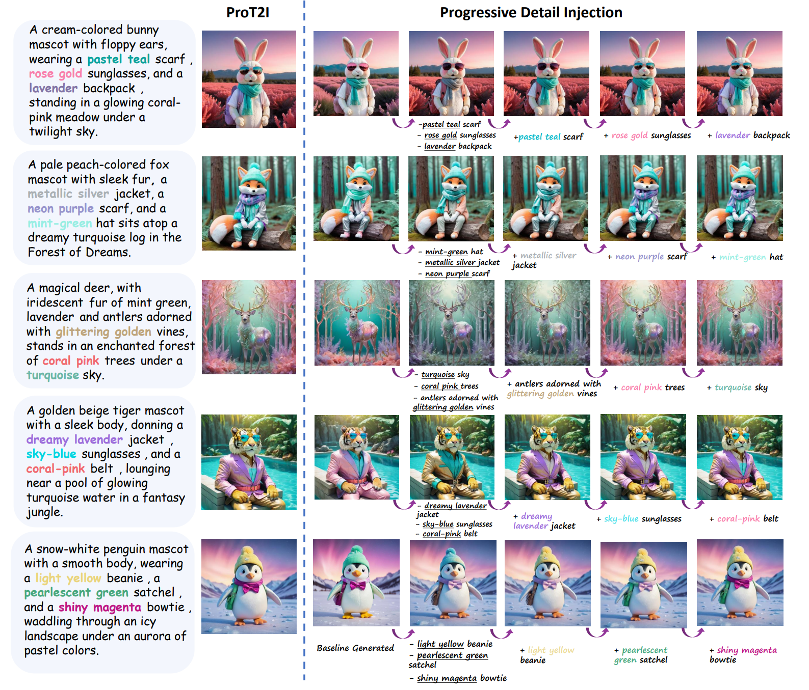

  <h3 align="center"><strong>Progressive Detail Injection for Accurate T2I Generation</strong></h3>
  

 &nbsp;&nbsp;&nbsp;&nbsp;
 

    

## ToDo List
- [ ] Publish extension methods in combination with control-net.
- [X] **[2024/12/9]** Gradio code is uploaded. 
- [X] **[2024/11/28]** Publish notebooks for visualization.
- [X] **[2024/11/27]** Publish the complete code.
- [X] **[2024/11/27]** Create the repo. 

## Overview
### Abstract
Text-to-image (T2I) generation has made significant strides in recent years, yet challenges remain, particularly when handling long and complex textual descriptions. Existing models often struggle to accurately map intricate text prompts to coherent and high-quality visual representations, leading to issues such as the loss of important subjects, attribute confusion, and incoherent images. These issues are amplified as the complexity and length of the prompts increase. To address these limitations, we propose a novel training-free approach for accurate **T2I** generation, called **Pro**gressive detail injection (**ProT2I**), which improves the generation of images from complex, multi-subject prompts. Our method decomposes complex prompts into progressively detailed versions, utilizing a multi-branch network that processes these versions in parallel. A novel attention propagation mechanism ensures the accurate injection of detailed attributes into their corresponding regions, effectively preserving both global structure and fine-grained details. The flexibility of our approach allows it to be seamlessly integrated with existing state-of-the-art T2I models as a plug-and-play enhancement. Extensive experiments on public benchmarks demonstrate that our method outperforms existing models in terms of text alignment and image quality, effectively mitigating attribute confusion and maintaining high-fidelity generation.
### Method

    

**Overview of the pipeline.** I) Parallel inference is the main body of our method, which has branches of different simplicity to be denoised. Optionally, we can copy the original prompt as $p_0$ before the base prompt $p_1$ to get comprehensive context information. In detail, II) progressive attention substitution realizes the structural information to be propagated between different branches, keeping the layout consistent while progressively injecting new attributes. III) Instance Wise Semantic Masking extracts binary masks of specific subjects from the cross-attention map, further ensuring that the correct attributes are added in the corresponding regions.

## Setup
### Memory comsuption
This code is based on parallel inference of stable diffusion models. 
Here we offer two versions of the code based on SD1.5 and SDXL separately, but our method can be extended to many pre-trained models as a plug-and-play module. 
Emperically, **one branch generation** (at 512x512 resolution) costs approximately **2.3GB** VRAM in SD1.5; for SDXL, **one branch generation** (at 1024x1024 resolution) costs approximately **13.4GB** VRAM.
Due to the flexibility of our method, the number of attributes of each branch can be freely adjusted, where a branch represents an image generated by a sub-prompt. Emperically, we can conclude all attributes belonging to one subject into one branch, which is good enough for generating results already, but **More Branches Means More Accureate**. Here is more space for users to make adjustments.

### Code to choose
- 🚀 ChatGPT automatic parsing is supported in our code, which can be seen in [run_sd1_5.py](https://github.com/CONSTANT1386/Progress-Detail-Injection-for-Accurate-T2I-Generation/blob/main/run_sd1_5.py). 

- 🐲 However, **we strongly recommend that you decompose the sentences manually** due to the unstable output of the api invoke. Detailed in [run_sd1_5_manual_decomposition.py](https://github.com/CONSTANT1386/Progress-Detail-Injection-for-Accurate-T2I-Generation/blob/main/run_sd1_5_manual_decomposition.py) and [run_sdxl_mannual_decomposition.py](https://github.com/CONSTANT1386/Progress-Detail-Injection-for-Accurate-T2I-Generation/blob/main/run_sdxl_mannual_decomposition.py), you can assign the number of attributes in each branch freely.

- 😻 We also offer two notebooks ([ProT2I SD1_5 notebook.ipynb](https://github.com/CONSTANT1386/Progress-Detail-Injection-for-Accurate-T2I-Generation/blob/main/ProT2I%20SD1_5%20notebook.ipynb) and [ProT2I SDXL notebook.ipynb](https://github.com/CONSTANT1386/Progress-Detail-Injection-for-Accurate-T2I-Generation/blob/main/ProT2I%20SDXL%20notebook.ipynb)) to visualise the method and **visualise the corresponding Self Attention Map and Cross Attention Map separately in the generation process**.

### Branch setting
To take the advantage of Instance-Wise Semantic Masking, we suggest to orgarnize attributes in two methods: **One subject, one branch**, where you can add multiple attributes belonging to a topic between two consecutive branches, or **One attribute, one branch**, where each attribute is added to the next branch for greatest accuracy. 

🔥🔥 Separate examples can be find in [ProT2I SDXL notebook.ipynb](https://github.com/CONSTANT1386/Progress-Detail-Injection-for-Accurate-T2I-Generation/blob/main/ProT2I%20SDXL%20notebook.ipynb).

### Gradio

## Extension
✨✨ Due to the flexibility of our method, it can be easily integrated many other plug-and-play modules, which will provide many possibilities. Here are a sequence of images demonstrating its flexibility when combining with control-net.

    

