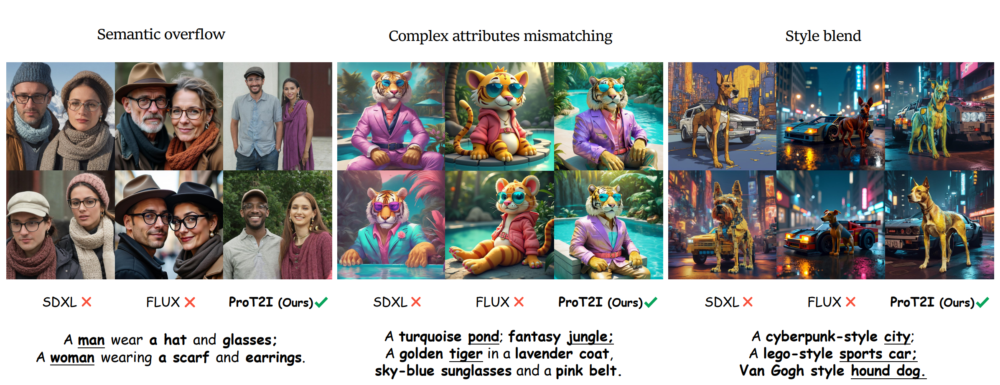
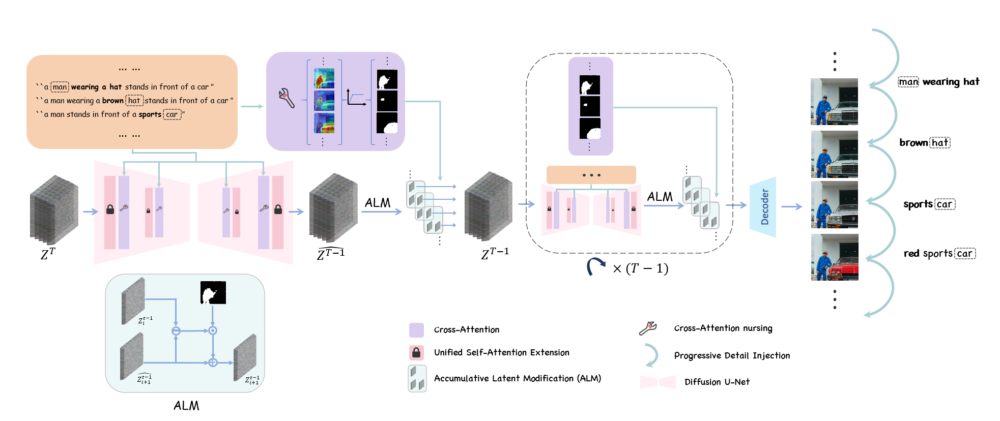

<p align="center">
  <h1 align="center">
  Progressive Detail Injection for Training-Free Semantic Binding in Text-to-Image Generation<br>
  </h1>
  <p align="center">
    <strong>Lifeng Chen</strong><sup>1</sup>
    &nbsp;&nbsp;
    <strong>Jiner Wang</strong><sup>1</sup>
    &nbsp;&nbsp;
    <a href="https://pan-zihao.github.io/"><strong>Zihao Pan</strong></a><sup>1</sup>
    &nbsp;&nbsp;
    <a href="https://beierzhu.github.io/"><strong>Beier Zhu</strong></a><sup>1, 2</sup>
    &nbsp;&nbsp;
    <a href="https://scholar.google.com/citations?user=99ZjBGoAAAAJ&hl=en"><strong>Xiaofeng Yang</strong></a><sup>1, 2</sup>
    &nbsp;&nbsp;
    <a href="https://icoz69.github.io/"><strong>Chi Zhang</strong></a><sup>1✉</sup>
    <br>
    <br>
    <sup>1</sup>AGI Lab, Westlake University,</span>&nbsp;
    <sup>2</sup>Nanyang Technological University</span>&nbsp;
    <br>
    <br>
    <a href='https://arxiv.org/abs/2412.08503'></a>&nbsp;
    <a href='https://ProT2I-official.github.io/'></a>&nbsp;
    <a href="https://huggingface.co/spaces/Westlake-AGI-Lab/ProT2I"></a>
    <br>
    
  </p>
</p>

## 📑 Introduction
This paper introduces a novel method for addressing **semantic binding** in text-to-image (T2I) generation. Our approach employs a progressive injection mechanism to accurately assign attributes within the correct subject regions. Notably, the proposed method not only mitigates semantic overflow but also overcomes the challenge of **style blending—issues** that existing techniques fail to resolve. The core idea involves initially removing all attributes and then reintroducing them sequentially within a unified self-attention framework.




For technical details, please refer to our paper.

## 🚀 Usage

1. **Environment Setup**

   Clone the code and prepare the environment:

   ```bash
   git clone https://github.com/Westlake-AGI-Lab/ProT2I
   cd ProT2I
   pip install -r requirements.txt
   ```

   Additionally, download the SpaCy model for syntax parsing:

   ```bash
   python -m spacy download en_core_web_sm
   ```

2. **Configure Parameters**

   Modify the `config.py` file to adjust runtime parameters as needed. Our framework is highly flexible, enabling adjustments to parameters such as prompt text, mask threshold, and attention map substitution percentage, which in turn yield a diverse range of interesting results. The key parameters are outlined as follows:

   - `prompt`: Text prompt for guiding image generation.
   - `use_nlp`: Whether to decompose the string in `prompt` automatically using SpaCy.
   - `sps`: A list of sub-prompts. You can design diverse sub-prompts freely like color, object accessory, and style to achieve different effects. Worked when `use_nlp` is set to `False`.
   - `nps`: A list of noun pharses. Means the corresponding subject of current adding attributes. `None` here means the influence region will be the whole image. Worked when `use_nlp` is set to `False`. 
   - `lb_t`: The threshold for masking out the image regions. Varing from -1 to 1, where -1 means no masking.

3. **Run the Example**

   Execute the main script `run.py`:

   ```bash
   python run.py
   ```

   The generated images will be saved in the `runs-SDXL/style-test` directory.

## 📸 Example Outputs

If everything is set up correctly, `RunConfig1` and `RunConfig2` should produce the left and right images below, respectively:


## ⚠️ Notes
- **Custom Configurations**: Please refer to the `config.py` file for customizing the runtime parameters.
- **Parameter Sensitivity**: This method retains the sensitivity characteristic of inference-based optimization techniques, meaning that the generated results are significantly influenced by the choice of hyperparameters. Careful tuning may be necessary to achieve optimal performance.
- **NLP Models**: When using NLP models like SpaCy for token parsing, ensure the correct language model is installed. Here, we provide a simple adjective phrase parser that may not be accurate in all cases.

## 🙏 Acknowledgments

This project builds upon valuable work and resources from the following repositories:

- [Attend-and-Excite](https://github.com/yuval-alaluf/Attend-and-Excite) 
- [ToME](https://github.com/hutaiHang/ToMe/tree/main)
- [🤗 Diffusers](https://github.com/huggingface/diffusers) 

We extend our sincere thanks to the creators of these projects for their contributions to the field and for making their code available. 🙌